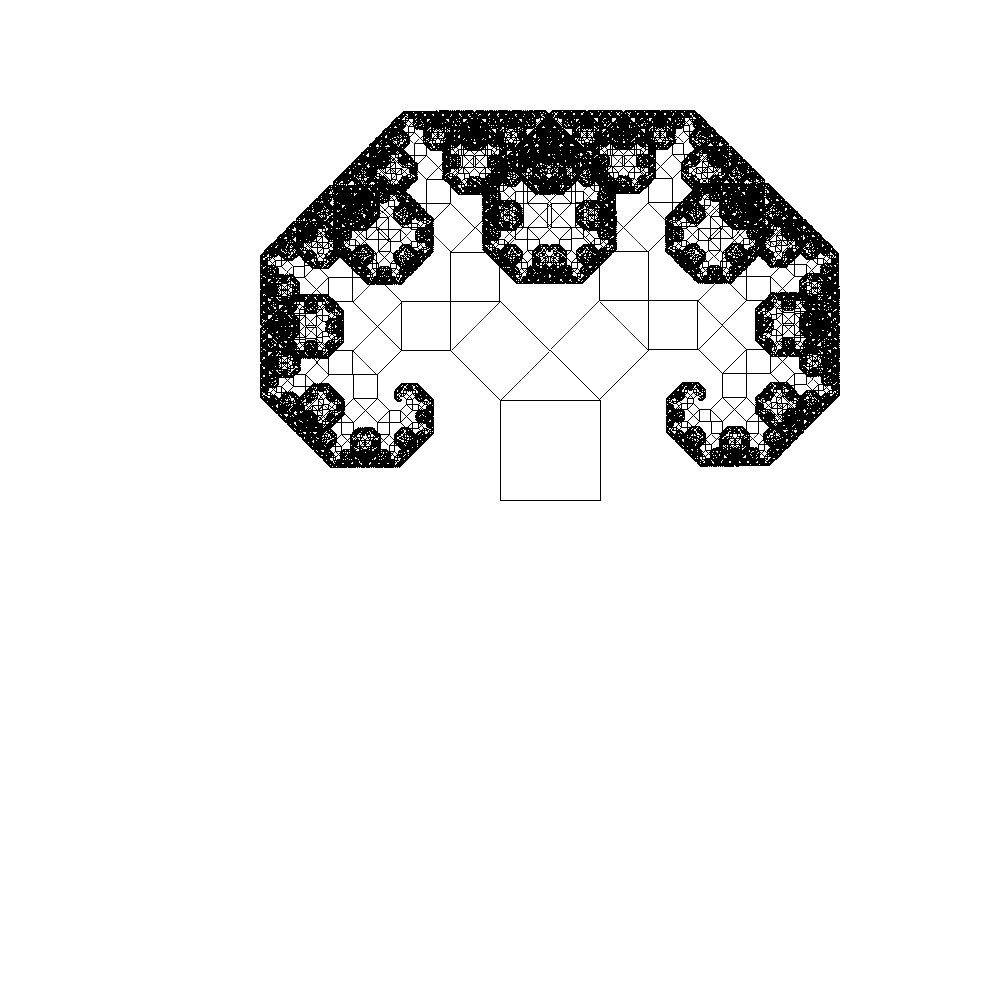
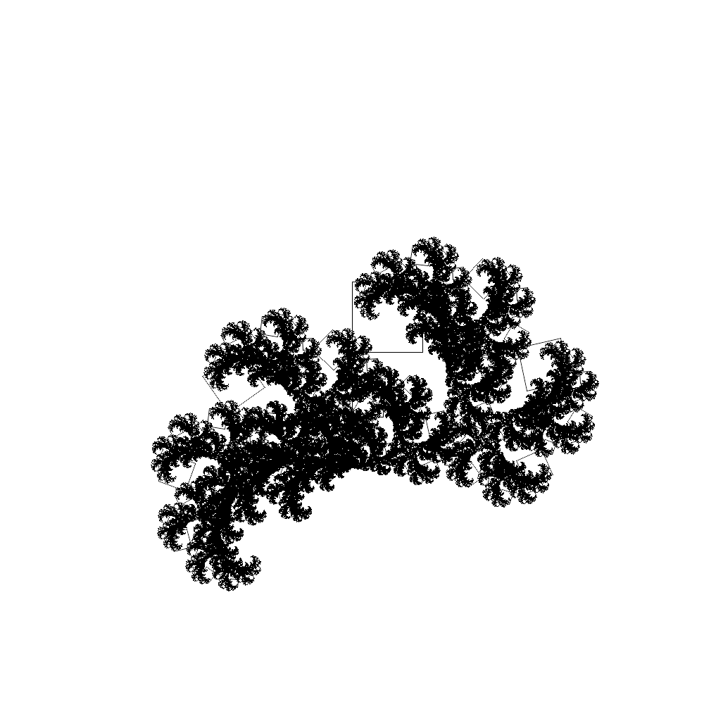
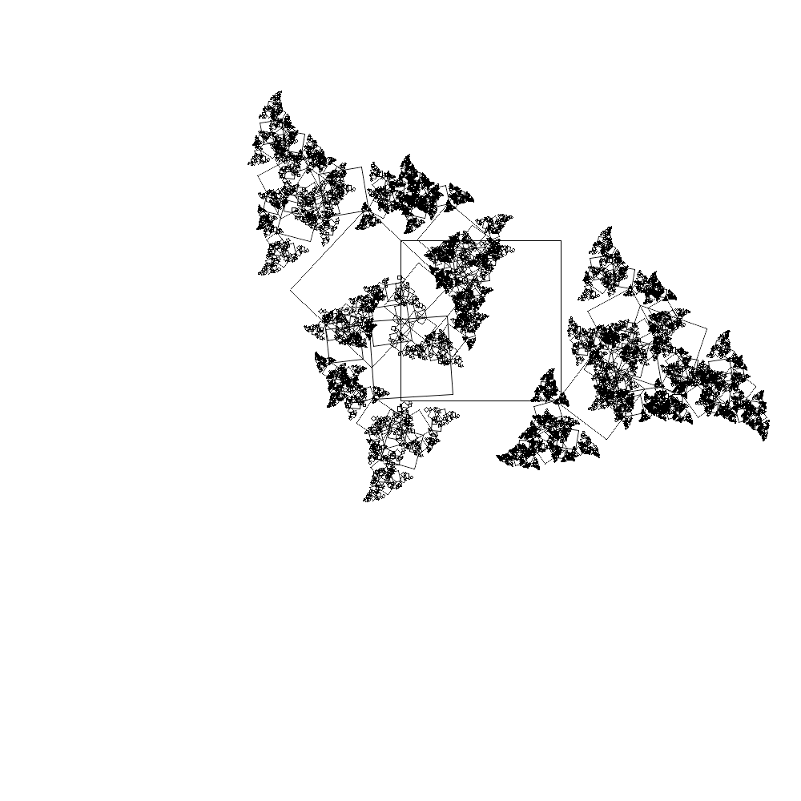
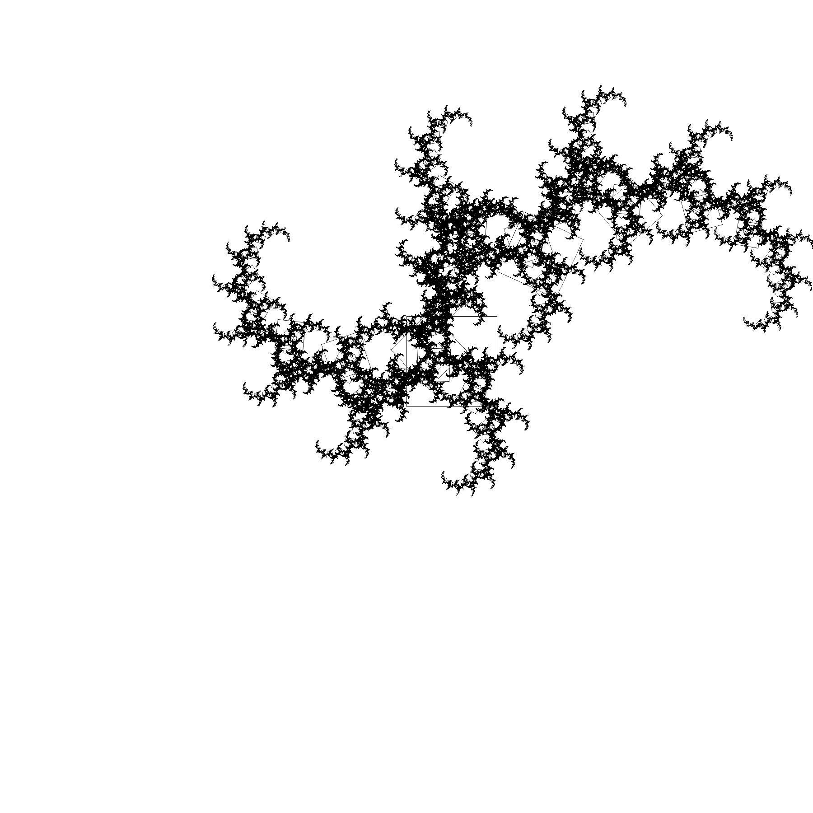

FractalsRB
=======================================================================0

Fractals are something nice and fantastic to explore.  
This is a small gem to create fractals similar to the [Pithagoras tree](https://en.wikipedia.org/wiki/Pythagoras_tree_(fractal)).

The main idea is that these fractals are iterations of a translation, a rotation and a resizing of the original object.

To install FinnhubRB: `gem install fractalsrb`

To use it in your application: `require "fractalsrb"`

## How to use it

``` ruby
similar = Fractal::Similar.new(repetition: 8, size_square: 200.0) # Create an instance with 7 repetition and starting size_square of 100px
similar.add(x: 0, y: 200, rotation: 45, size: 0.72) # Add a square that reproduce itself by translating by 40px on the x-axis, by 50px on the y-axis, rotate of 45° and each iteration will be half bigger than the previous one
similar.add(x: 100, y: 300, rotation: 315, size: 0.72) # Add another iteration
similar.build # Build the fractal
similar.points # Retrieve the points (each 4 points is a square)
```

You can obtain directly a picture by using the following way:

``` ruby
canvas = Fractal::Canvas.new(width: 3000, height: 3000, size_square: 200.0, repetition: 7,
  fractals: [{x: 0, y: 200, rotation: 45, size: 0.72}, {x: 100, y: 300, rotation: 315, size: 0.72}])
# Create a canvas instance. Width and height will be the size of the resulted png in pixels
canvas.build # Build the canvas
canvas.picture # Return the file
```

## How to test it

The best way to see the potential of this small gem is by using the small website provided inside of the Github repository (not in the gem).

The steps are simple:

1. Clone this repository
2. Use ```bundle install```
3. Run ```rake``` (port 4567 will be freed)

This will start a small server on port 4567 and it will open your browser for a testing website.  
Keep in mind that it can be very expensive, expecially if you use a high number of repetitions (> 10) and iterations.

The results in my opinion can be astonishing. Some examples:





